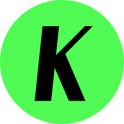

# AI智能抠图

<p align="center">
  
</p>

<p align="center">
  <strong>🎨 纯本地运行的 AI 智能抠图工具</strong>
</p>

<p align="center">
  基于 RMBG-1.4 模型 | 无需网络 | 保护隐私 | 免费无套路
</p>

---

## ✨ 功能特性

| 功能 | 描述 |
|------|------|
| 🎯 **AI 智能抠图** | 基于 RMBG-1.4 模型，一键去除背景 |
| 📐 **支持任意尺寸** | 横版、竖版、方形图片均可处理 |
| 📦 **批量处理** | 一次最多处理 10 张图片 |
| 🎨 **边缘优化** | 羽化、平滑、锐化等参数可调 |
| 🖼️ **背景替换** | 透明、纯色、图片背景自由切换 |
| 💾 **多格式导出** | PNG、JPG、WEBP 格式任选 |
| ⚙️ **参数记忆** | 自动保存上次使用的设置 |

---

## 📸 效果预览

<p align="center">
  
</p>

---

## 💻 系统要求

- **操作系统**: Windows 10 / Windows 11
- **内存**: 建议 8GB 以上
- **磁盘空间**: 约 500MB（含 AI 模型）

---

## 🚀 快速开始

### 方式一：下载 Release（推荐）

1. 前往 [Releases](https://github.com/zhengqingke-beep/ai-background-remover/releases) 页面
2. 下载最新版本的 `AI智能抠图-x.x.x.zip`
3. 解压后运行 `AI智能抠图.exe`

### 方式二：从源码构建

```bash
# 克隆仓库
git clone https://github.com/zhengqingke-beep/ai-background-remover.git
cd ai-background-remover

# 安装依赖
npm install

# 运行开发版
npm start

# 构建发布版
npm run build:win
```

---

## 📖 使用教程

### 单张抠图
1. 点击上传区域或拖拽图片
2. 自动处理，实时预览
3. 调整参数（羽化、平滑、阈值等）
4. 选择导出格式，点击「导出图片」

### 批量抠图
1. 选择多张图片（最多10张）
2. 点击「开始批量处理」
3. 处理完成后点击「导出全部」

---

## 🔒 隐私声明

✅ 所有图片处理完全在本地完成  
✅ 不上传任何数据到服务器  
✅ AI 模型本地运行，无需网络  
✅ 保护您的隐私安全

---

## 🛠️ 技术栈

- [Electron](https://www.electronjs.org/) - 跨平台桌面应用框架
- [ONNX Runtime Web](https://onnxruntime.ai/) - 模型推理引擎
- [RMBG-1.4](https://huggingface.co/briaai/RMBG-1.4) - 背景移除模型

---

## 📄 许可证

本项目采用 MIT 许可证。详见 [LICENSE](LICENSE) 文件。

### 第三方组件

- **RMBG-1.4 模型** - [Bria AI 使用条款](https://briaai.com/right-to-use)
- **ONNX Runtime** - MIT License
- **Electron** - MIT License

---

## 📞 联系我们

- **官方下载**: 公众号「庆科字体」
- **问题反馈**: 502753829@qq.com
- **GitHub Issues**: [提交问题](https://github.com/zhengqingke-beep/ai-background-remover/issues)

---

## 🤝 贡献

欢迎提交 Issue 和 Pull Request！

---

## ⭐ Star History

如果这个项目对你有帮助，请给一个 ⭐️ 支持一下！

<p align="center">
  <a href="https://github.com/zhengqingke-beep/ai-background-remover/stargazers">
    
  </a>
</p>
